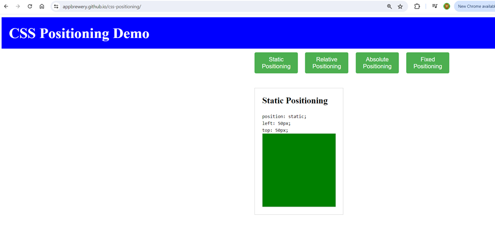
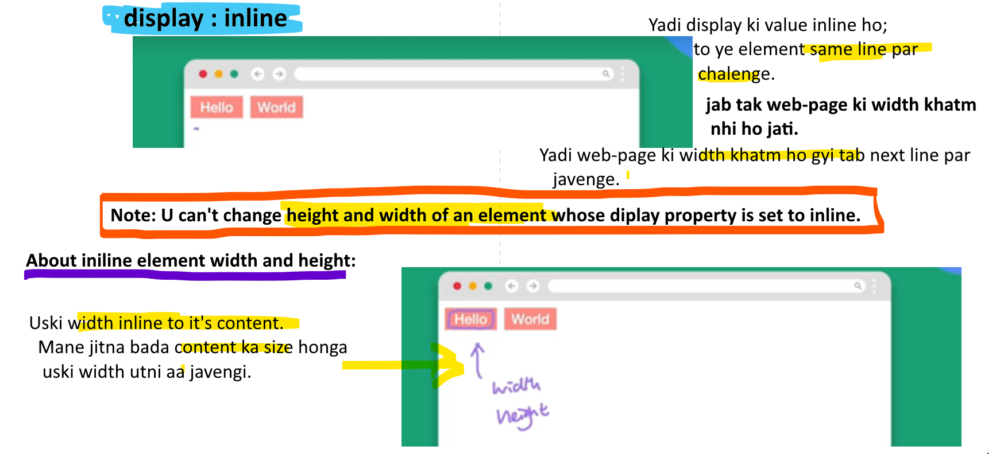
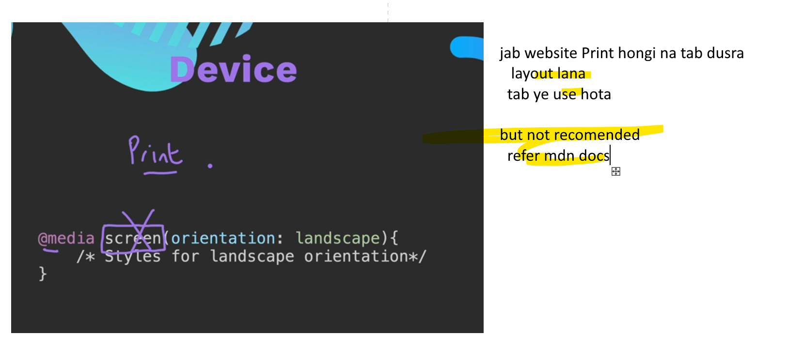
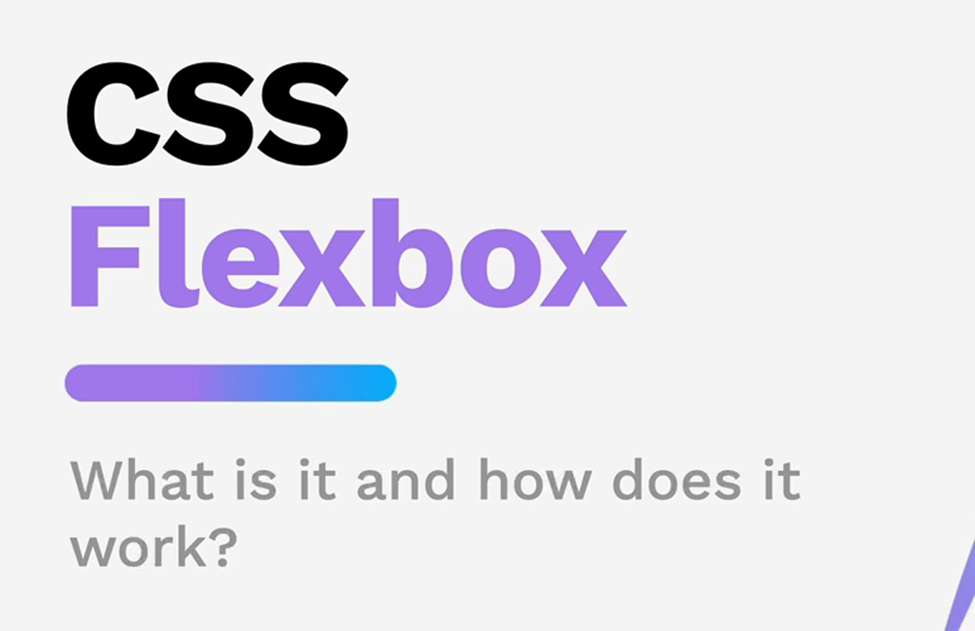
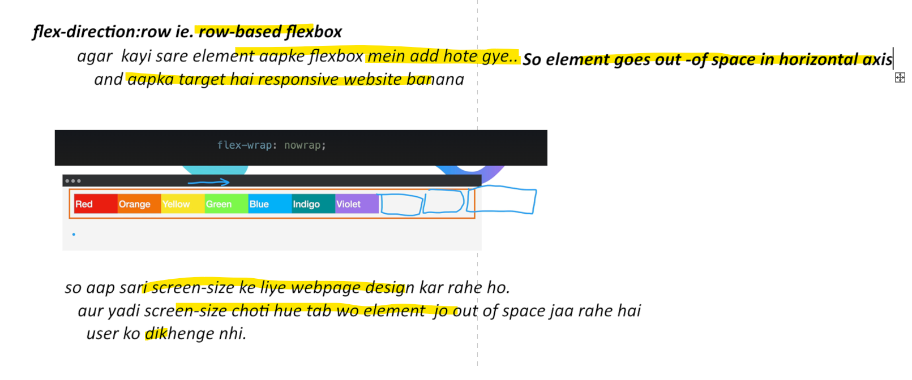
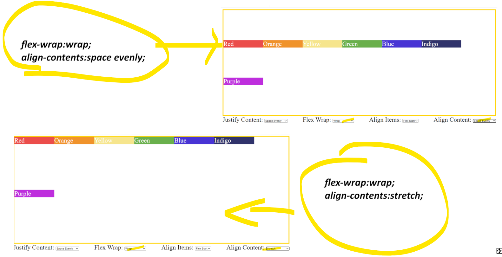

# Section-1
# 5. How does internet actually works?
# Section-2
# 11. What is HTML?

# Section-3
# 13. What are webpages?

### A website contain multiple webpages. We provide link between multiple pages in a website.

# 14. The Html boiler plate.

### Doctype declaration
<! DOCTYPE html> -- doctype declaration  
- Aap konse type ka doctype use kar rahe ho 

### Root of Doc is html
- we use language for read out website

### About Head tag

- Head doesn’t include any content that user  can see
- Meta tag – for charcter set encoding of the web page
- UTF-8 jo character aapke use ho rahe hai wo website mein  display ho correctly
    -  kuch Charaset mein emoji allow nhi hai
    - kuch mein multiple, division ye sysmbol allow nhi hai
### About Body
- Body tag mein aall of the website content goes here
    -  like text,  images etc

### About shortcut
! + Enter shortcut 
- but remember
    - ye sirf .html website ke liye kaam karta
### Some other stuff

- This line keep your html compatible with internet explorer


- How you display/render website when it first open
# 28. Project portfolio webiste
jazz this up - to make sth more intresting and attractive
# 29. Hosting your website

### About Web hosting?
 - It is basically a process of Making your website available anywhere on the internet.
 #### 1. Local Developement
 
 #### 2. Hume Webhosting ke liye isse dalna honga webserver par
 
 ### Git Hub
 
 #### 1. About uploading the content
 
 - About index.html  
    - ye lower case hi hona chahiye
    - index.html ki karya karenga,home.html ya etc nahi
- About folder
    - folder drag nhi karna sirf content
    - nhi to kaam nhi karenga
- Then clk on commit change
### Now Branch change

- Change to main branch
    - clk on save
    - then refresh it 
    - it will take some time


https://aditya-hulk.github.io/html-portfolio/
# 30 Capstone project
- Banda ye web devloper hai
- apne portfolio mein bata raha hai, 
    - ki maine falana company ke sath kaam kiya
- client hier karte waqt uski achievements dekhenga 
- That's exactly the capstone project


### Use git hub for that


# 31 Instruction


# Section-7 Intermediate CSS
# 43. The Cascade Specificity and Inheritance
### Hume yaha ye dekhenge ki Yadi aapke element par 1 se jyada rule apply ho rahe hai, toh exactly konsa rule uske liye applicable honga.

### Observe:

- Yadi hum pool ko observe kare
- so top level rule i.e No 2 ye sarvapratham apply honga
- But water level niche jate jate Number-1 rule ye applicable honga.
- and user ko No-1 rule dikhenga
### ***Category which define level of Importance***

### ***Position***

#### yaha blue override karenga red color ko since wo niche apply hai.

#### Yaha green applicable honga, since lower down position par hai. So In position rule, lower down position has more importance.
### ***Specificity***
 
 - So Id selector has more importance than above selectors.
 ### ***Type***
 
 ### ***Importance***
 
 ### ***Hierarchy***
 
 -  Importance has higher priority than anything above.
 - Then type, then speicificity and last Position
 ### Ab yadi mix-match mein chije aayi so aapko ye chart dhyan mein rakhna honga
 
 - Yeh code mein specificity category mein id selector dikh raha hai
 - aur yaha type category  inline css hai
- type category ye specificity category se important hai
- so in this case inline css ka rule applicable honga.
- so color will be green 
# 44. Combining CSS Selectors
### ***Group rule for CSS Selectors***
- yadi aapko ek se jyada selectors par same rule apply karna hai 
    - tab ye Group rule apply kare.


- for differntiating multiple selectors use comma
### ***Child rule for CSS slectors***
- ye rule direct desendents par applicable hota.
    - mane direct child ko aapko target karna ho tab child rule apply kare.


```html
<body>
  <div class="flag">
    <p>The Flag</p>
    <div>
      <div>
        <p>of Laos</p>
      </div>
    </div>
  </div>
</body>
````
- Upar eg mein Parent div ke direct child kon konse hai
    - p para tag
    - div tag
### So in order to target this we can use this Child rule.
```html
.flag > div{
    background-color=green;
}
```
#### Important tips regarding Child rule Selector

- so here 1st seletor is parent 
- 2nd selector is child 
- this rule is applicable for direct children
    - not on grand chidren or great grand chidren.
- This relation only 1 generation deep
### ***Descendent Rule for CSS selectors***

- provide space in multiple selectors
```html
<body>
  <div class="flag">
    <p>The Flag</p>
    <div>
      <div>
        <p>of Laos</p>
      </div>
    </div>
  </div>
</body>
```
#### Yadi aapko target karna hai paragraph tag ko wo bhi of Laos wali so we apply this rule.

```html
 .flag  div div p{
      color: yellow;
    }
```
### ***Chaining Rule for CSS Selectors***

#### Important note
#### uprokta tag ko khangale so hume usme 3 selecotor mil rahe hai

#### So chain rule applicable karte waqt sarvapratham element selector aayenga uske baad class/id selector
### Why?
#### Aapne yadi pehle class selector likhe aur uske baad element selector

#### Ab ye class selector .big and element selecotor i.e h1 ko separate nhi padenga aur .bigh1 ye combine kar padenga
#### so ye ab dhundenga is name ki class jo milengi nhi, isiliye in chain rule use this concept.
### ***Combining combiners***

#### Aap differnt combination like 
- parent-child with desendents etc combine kar sakte
```html
<body>
  <div class="flag">
    <p>The Flag</p>
    <div>
      <div>
        <p>of Laos</p>
      </div>
    </div>
  </div>
</body>
```
#### yaha hum parent-child aur desendents selector combine kar rahe hai.
```html
.flag  > div div p{
      color: yellow;
    }
```
# 45. CSS positioning
### When developer dosen't understand the concept of positioning Then this haapen's.

### Types of positioning

### For understanding positioning go to this website
https://appbrewery.github.io/css-positioning/
### ***Static Positioning***

- static positon lagane ki jarurat nhi padti
- by default applicable hoti hai.
- aap isme kuch aur element add karo wo prvious element ke niche aa javenga
### ***Relative positioning***

#### Pehle by default static position kaise thi

#### After htting relative position button

#### Remember

- Relative to supposed location
- static position par image aise thi..
- relative par left aur top se differntiate ho gyi.
### Note:
- Static position ye html ki default positon hoti hai
- Mane ab aapko position lagana hai so bacha relative aur absolute
### ***Absolute position***

### 1. Position relative to nearest position anscestor

### 2. But yadi anscestor ki position set nhi hai, tab wo web page ke top left corner par aa javenga

### Observe: Yaha itne sare ansector hai, kahi bhi position set nhi hai; that's why come to top corener

- So top se 50px aur left se 50px push hua hai
### ***Z-Index***
#### konsa element top par avenga here that's we specify in z-index

#### About z-axis

#### Now provide z-index

#### Eg- Abhi ye abosolute block sab ke upar dominate kar raha hai

#### hum iski z-index property negative kar dete

#### Note: har element ka Z-index 0 hota hai
### ***Fixed position***

#### Diff in Absolute and Fixed
- absolute position is top left of web page
- fixed postion is top left of browser window
- ye position fixed hi rehti kitna bhi scroll karlo, but absolute  position  fixed nhi rehti.
#### Aaap top left bhi kar sakte ho

#### aap margin bhi add kar sakte ho

#### Note:
The position is actually separate from the margin, which in turn is separate from the padding,
which in turn is separate from the width and the height.
### ***How to create a circle in CSS***
#### Create a rectangle

#### Use border radius property - yaha thoda tild hua

#### aaple logo

#### circle

### Program solution
- Now notice these numbers that I've given here 150px, 250px,
- basically they are half, 250 is half of 500
and 150 is half of 300.
- Essentially, I wanted the top left corner of this circle to be right in the middle of the rectangle.
- Alternatively to setting these pixel values, you could have also set it to 50% from the top and 50%
from the left.
- It would achieve exactly the same thing.

# Section-8 Advanced CSS
# 48. CSS Display

### Here we basically focus on website layout.

### what happen when display value is inline.

### About Display property

### What happen when display having block value?

### What happen when display having inline value?

### What happen when display having inline-block value?

### What happen when display having none value?

### Go to this website
https://appbrewery.github.io/css-display/ 
### In website we have follwing things.

#### Regarding block u can change height and width

#### for inline - nothing is going to change

#### Regarding inline-block
##### U can change height and width but same line par chalenga

##### Par element ki width badh gyi to next line par javnega

# 49. CSS Float

### Use float property to wrap text around 
#### via float:left

#### via float:right

### About image and paragraph element

### About clear property

#### aapko footer par float property set nhi chaiye

### What happen if you apply float property 

#### Observation: Abhi image ke baju mein paragrapy aur footer dono float ho rahe hai. But hume footer ko float nhi karwana. 
### use clear property

### Eg: Target

#### float:left aur float:right se dono ek mek se alag ho javenge.

#### aur clear:both se footer niche aavenga

## Note: For Wrapping text around use float and for designing ke liye flexbox/grig/bootstrap etc.
# 50. How to create a responsive website.
## What do you mean by responsive website.

### Go to this website
https://tastybasics.nl/
- humme isse chota-bada kare
- ye website responsive na hone ke wajah se alag dikh raha hai.
### 4 tarike se responsive website banate aati.

#### 1) Media query

#### 2) via CSS Grid

- Grid ye 2D layout par apply hota hai.
#### 3) via Flexbox


- Flexbox is good for creating 1D layout
- gist:=
    - the main point or part
- yaha sab ratio or proportion mein hai,
    - so width change ho javengi dynamically
    - ie responsive website.
#### 4) BootStrap framework
 

# 51. Media Queries

### via eg

### regarding max width

### regaridng min-width

### Combination

### About device



# Section-9 Flexbox
# 54. Display Flex

- Semantically :  
  - in a way that is connected with the meaning of words, शब्दार्थ
  - when people are talking about code being semantically correct :->  
	- i.e they're referring to the code that accurately describes something.

- Fidly : 
  - requiring close attention to detail 
- coveting-
	 - लालच
- Tweak 
  - CHANGE SLIGHTLY
  - to change something slightly, especially in order to make it more correct, effective, or suitable: 
### ***Designing website layout***

### ***Problem in floats***

### ***When to use floats and when to use flexbox.***

## ***Design a website layout via flexbox.***

### ***Note***

## ***2 version of Flexbox container***
## 1) flex

## 2) inline-flex

# 55. Flex Direction

### ***In Html***

### ***In FlexBox***

## About Axis
###  ***When flex-direction:row*** 

### ***When flex-direction:column***

***Note: All this stuff is important for customization***
## ***Different behaviour of flex-basis property;***
### ***1) When flex-direction:row and flex-basis:100px***

### ***2) When flex-direction:column and flex-basis:100px***

## ***Note:***
- Flex-basis aur other property they are flexing along with main axis
- Flex-direction : row 
  - So flex-basis  ye width set karta
- Flex-direction:column
  - So flex-basis ye height set karta
# 56. Flex-Layout

## ***Note:***
- Jo bhi property aapko lagana hai usse sarvapratham check karlo
  - ki Wo property Parent par lagni hai 
  - ya ki child par
### ***About terminology Parent-child***

## ***Properties***
### ***1) Order***

### ***2) flex-wrap***

### ***The defualt behaviour of flexbox***

### ***when flex-wrap:wrap***

### ***when flex-wrap:wrap and flex-wrap:wrap-reverse***

- ***sort of meaning:***
  - in a way
### ***3)	Justify-content property:***
- ***justify content meaning :***
  - The justify-content property aligns the flexible container's items when the items do not use all available space on the main-axis (horizontally).
  - सिद्ध करना
### ***About justify content**

### ***About axis***

### ***In details***

- ***godsend meaning:***
  - something very lucky or helpful 
### ***3)align-item property***

- abhi row based flexbox hai yadi column-based-flexbox hua
  - so main axis at vertical
  - and cross axis at horizontal
- align item:
  - ye property parent mane container par apply hoti hai.
  - na ki child mane flexItems par
### ***About viewport height***

### ***Eg regarding align-items***


### Note:

### ***About align-self property***

- Overwhelmed:
  - If something overwhelms someone or something, it is too much, or almost too much, for them to manage
  - घबराया हुआ व्याकुल
### ***4)	Align-content***

## ***CSS flexbox cheatsheet***
https://css-tricks.com/snippets/css/a-guide-to-flexbox/
## ***Eg Understand***
https://appbrewery.github.io/flex-layout/
## ***Eg practice***

https://appbrewery.github.io/flexboxfroggy/
# 57. Flex- sizing


# Section-11
# 64. What is bootstrap?

### ***Why it became so popular?***
- Isme pre-made CSS files di hoti hai. 
  - Aap unhe apne project mein include karo
  - aur bootstrap ke pre-built components and styling use karo.
- Bootstrap also provide 12-column layout system.
  - That make really easy to create responsive website.
- ***Ye Felxbox ke upar bana hai.***
### Eg

### ***How to use bootstrap***

### ***What is CDN?***
- full form is  content delivery network
- This are little hubs across the world and it knows where the user is located.
- So jab bhi aap apni website load karonge aur aap try to access the particular css file jske andar
Sare bootstrap ka code hai.
- Ye closest location to server provide Karenga. Jaha se content aapko mil javenga.
### Other things

### another one

## ***Note*** 
- jab bhi hume bootstrap ki style sheet ko override karna hai.
- 1) inline stylesheet
- 2) internal style sheet <style tag ke andar mein provide karo 
- 3) aur yadi external style sheet hai.
   Tab bootstrap ke link ke niche mein apni link provide karo.


